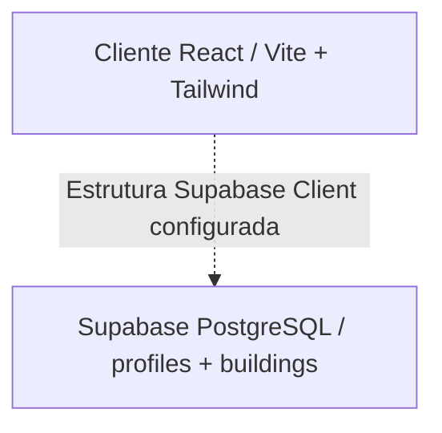
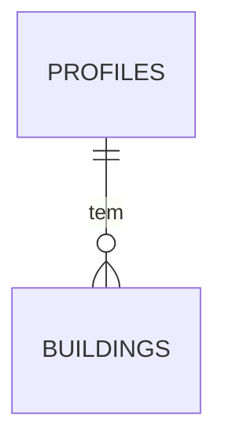

# Relatório de Arquitetura do Sistema: Eldoria (Clean Slate)

Este documento apresenta uma auditoria e especificação técnica atualizada da arquitetura da aplicação **Eldoria (Medieval Stuff)** após a limpeza e consolidação DevOps do workspace, configurando-a como um boilerplate limpo para futuros ciclos de desenvolvimento.

---

## 1. Visão Geral da Arquitetura & Fluxo do Sistema

### Resumo de Alto Nível da Arquitetura
A aplicação adota uma **Arquitetura de Apresentação Cliente-Servidor (BaaS)** em fase de mockup.

*   **Frontend (React + Vite)**: Toda a camada visual e interface interativa está concentrada na diretoria `/client`. O ambiente de backend Node.js (`/server`) e os artefactos de deploy antigos foram eliminados para remover dependências desnecessárias.
*   **Base de Dados (Supabase/PostgreSQL)**: A ligação de base de dados Supabase foi simplificada, mantendo apenas a infraestrutura para tabelas essenciais (`profiles` e `buildings`), permitindo relançar o desenvolvimento de raiz.

### Fluxo de Dados Principal
No estado atual de *Clean Slate*, a reatividade da aplicação foi simplificada:

1.  **Interação Visual**: O utilizador interage com o HUD de topo e com o mapa isométrico do reino.
2.  **Lógica Estática**: As interações de clique no menu inferior ([BottomNav.jsx](file:///c:/Users/silva/.gemini/antigravity/Medieval%20Stuff/client/src/components/BottomNav.jsx)) e nos edifícios ([IsometricMap.jsx](file:///c:/Users/silva/.gemini/antigravity/Medieval%20Stuff/client/src/components/IsometricMap.jsx)) estão bloqueadas (`disabled`), exibindo cursores correspondentes e impedindo o tráfego de rede desnecessário.
3.  **Renderização Local**: A UI lê estatísticas e configurações simuladas diretamente de uma constante local (`mockProfile` em [App.jsx](file:///c:/Users/silva/.gemini/antigravity/Medieval%20Stuff/client/src/App.jsx)), contendo informações sobre ouro, nível e XP do lorde, eliminando a latência de consultas à base de dados na inicialização da aplicação.

---

## 2. Interface do Utilizador (UI) & Experiência do Utilizador (UX)

### Mapeamento de Ecrãs/Páginas
A interface de Eldoria está centralizada numa página única interativa:

*   **Kingdom Hub (Mapa Isométrico)**: Fundo panorâmico em alta resolução (`Medieval_Town_Backround.png`) mapeado com **HitZones** posicionadas estrategicamente sobre as ilustrações dos edifícios. As HitZones são semi-transparentes ao pararmos o cursor.
*   **HUD (Heads-Up Display)**: Cabeçalho com o nome do Lorde, barra de progresso de experiência e recursos simulados de ouro (💰) e gemas (💎).
*   **Bottom Navigation Bar**: Barra de menu inferior que exibe os principais atalhos da interface, permanecendo estática na aba de Quests.

### Análise de Componentes de UI
Os componentes de interface ativos no frontend são:

| Componente | Papel no Sistema | Estado Atual / Interabilidade |
| :--- | :--- | :--- |
| `HUD` ([HUD.jsx](file:///c:/Users/silva/.gemini/antigravity/Medieval%20Stuff/client/src/components/HUD.jsx)) | Exibe o estado e recursos do perfil do utilizador. | Estático. Atualiza os dados consoante o objeto `profile` fornecido via propriedades (props). |
| `IsometricMap` ([IsometricMap.jsx](file:///c:/Users/silva/.gemini/antigravity/Medieval%20Stuff/client/src/components/IsometricMap.jsx)) | Mapeia e renderiza as HitZones de colisão do reino. | Estático. Os cliques foram desativados e o cursor do rato foi alterado para `cursor-not-allowed`. |
| `HitZone` ([IsometricMap.jsx](file:///c:/Users/silva/.gemini/antigravity/Medieval%20Stuff/client/src/components/IsometricMap.jsx)#L3) | Elemento individual invisível com tooltip flutuante. | Exibe uma tooltip tematizada adicionando o estado `(Under Construction)` ao nome do edifício. |
| `BottomNav` ([BottomNav.jsx](file:///c:/Users/silva/.gemini/antigravity/Medieval%20Stuff/client/src/components/BottomNav.jsx)) | Barra de navegação inferior do ecossistema. | Estática. Todos os botões estão configurados com `disabled`, cursor bloqueado e opacidade reduzida (`opacity-40`). |

### Avaliação de UX
*   **Gestão de Estados Visuais**: As interações exibem estados claros de impossibilidade de clique, permitindo que a equipa de arte e design visualize o esqueleto do produto sem induzir o utilizador a submeter formulários.
*   **Aparência Visual**: A estética medieval mantém-se intocada, utilizando paletes de cores Creme, Castanho Escuro e Ouro de forma harmoniosa, combinada com ícones da biblioteca Lucide React.

---

## 3. Lógica de Negócio & Funcionalidades Core

### Descrição dos Módulos Principais
A lógica de negócio complexa foi desativada para proporcionar um ponto de partida limpo (Clean Slate):

*   **Remoção Completa do Ledger**: Eliminadas as tabelas de registos, importadores CSV, gerador de relatórios Excel e lógicas associadas a despesas e receitas.
*   **Suspensão do Jogo Idle**: O temporizador (`setInterval`) e cálculos de colheita offline que geravam ouro passivo foram limpos, libertando ciclos de CPU do browser.
*   **Remoção de Dependências**: As bibliotecas de terceiros `chart.js`, `xlsx` e `papaparse` foram desinstaladas do projeto para otimizar os tempos de build e reduzir o tamanho dos ficheiros distribuíveis de produção.

### Gestão de Estado
O estado reativo no cliente foi minimizado. O componente raiz [App.jsx](file:///c:/Users/silva/.gemini/antigravity/Medieval%20Stuff/client/src/App.jsx) mantém apenas a atribuição da aba ativa `'quests'` para renderizar o reino, eliminando prop-drilling e contextos de base de dados pesados.

---

## 4. Modelo de Dados & Tabelas (Database)

O modelo de dados antigo foi descartado, criando-se um novo script relacional inicial e limpo no ficheiro **[db_reset_migration.sql](file:///c:/Users/silva/.gemini/antigravity/Medieval%20Stuff/SQL%20all/db_reset_migration.sql)**.

### Detalhe das Tabelas Base

#### 1. Tabela: `profiles`
Define a entidade do utilizador (reino) e as suas estatísticas essenciais.
*   **id** (`UUID`, Primary Key)
*   **email** (`TEXT`)
*   **gold** (`BIGINT`, Padrão: 1000)
*   **level** (`INTEGER`, Padrão: 1)
*   **xp** (`INTEGER`, Padrão: 0)
*   **updated_at** (`TIMESTAMP WITH TIME ZONE`, Padrão: `NOW()`)

#### 2. Tabela: `buildings`
Define a infraestrutura de edifícios de cada reino.
*   **id** (`UUID`, Primary Key, Padrão: `gen_random_uuid()`)
*   **profile_id** (`UUID`, Foreign Key referenciando `profiles.id` com ON DELETE CASCADE)
*   **type** (`TEXT`, Nome do edifício, ex: 'mine', 'treasury')
*   **level** (`INTEGER`, Padrão: 1)
*   **stored_resources** (`DOUBLE PRECISION`, Padrão: 0)
*   **last_collection** (`TIMESTAMP WITH TIME ZONE`, Padrão: `NOW()`)
*   **created_at** (`TIMESTAMP WITH TIME ZONE`, Padrão: `NOW()`)

### Relacionamentos
*   `profiles` para `buildings`: **1:N** (Um jogador possui múltiplos edifícios no seu reino, e estes são destruídos se o perfil correspondente for apagado).

---

## 5. API & Integrações

### API Exposta do Servidor
*   *[Informação em falta no contexto fornecido]* - Toda a infraestrutura Express local foi removida do repositório para assegurar a modularidade BaaS/serverless.

### Integrações de Terceiros
*   **Dicebear Avatars**: Chamada de API externa baseada em URL para renderizar o avatar do utilizador no HUD (`https://api.dicebear.com/7.x/pixel-art/svg?seed=...`).
*   **Lucide React**: Biblioteca de ícones vetoriais de cabeçalhos e menus.

---

## 6. Estado Atual da Documentação & Recomendações

### Auditoria de Código
O repositório apresenta-se extremamente limpo e simplificado. Foram eliminadas todas as referências de código morto e dependências órfãs. A documentação está centralizada na pasta dedicada `/documentacao`, em conformidade com as regras de organização de ficheiros do projeto.

### Débito Técnico & Pontos Críticos
*   **Infraestrutura Supabase Inativa**: A ligação da API do Supabase está declarada em `supabaseClient.js`, mas não existem chamadas ativas na UI.
*   **Interface Estática**: As interações de clique foram totalmente desabilitadas.

### Próximos Passos Recomendados
1.  **Escolha de Gestor de Estado**: Adotar Zustand ou React Context para futuras mecânicas que liguem o HUD a ações dos edifícios.
2.  **Mecânica de Jogo Ativa (Gold Mine)**: Implementar a recolha de ouro passiva utilizando de preferência Triggers e Functions do PostgreSQL no Supabase, evitando manipulação de tempo do relógio local do browser.
3.  **Desenho das Abas Bloqueadas**: Definir as especificações para o ecrã de conquistas ("Achievements") e configurações do reino para expandir a jogabilidade da aplicação.
