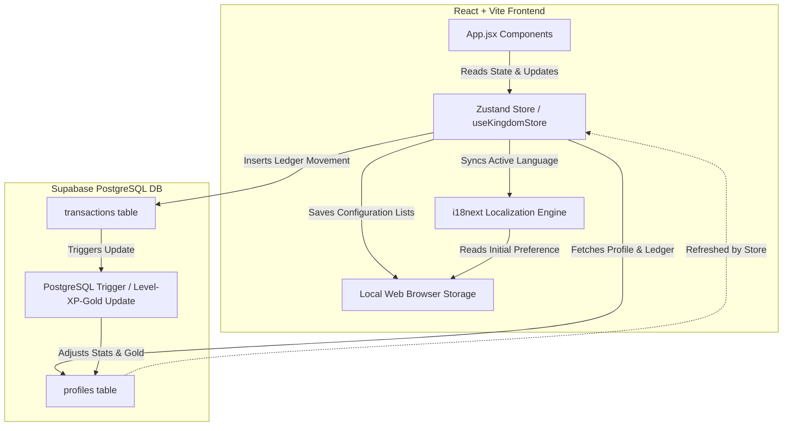

# System Architecture Report: Eldoria (Medieval Stuff)

This document provides a comprehensive technical audit and specification of the system architecture of the **Eldoria** game application. It details the state management layer, dynamic database synchronization, localization engine, and interactive layout structure.

---

## 1. High-Level Architecture & System Flow

Eldoria operates on a modern **BaaS (Backend-as-a-Service)** architecture, pairing a reactive React + Vite frontend with a Supabase PostgreSQL database for persistent data storage, real-time trigger updates, and user session statistics.



### Core Data Flow

1. **User Action**: The user records a transaction (ledger movement) in the Mine Modal or History Modal.
2. **Zustand Action Dispatch**: The application dispatches `registerTransaction` to insert the row into Supabase's `transactions` table.
3. **Database-Level Calculations**: PostgreSQL triggers automatically calculate the profile's accumulated XP, Level, and Gold balance in response to the insertion.
4. **Atomic State Refresh**: To avoid full-table data fetching overhead and race conditions, the store locally appends the inserted transaction to the `transactions` array and performs a lightweight single-row fetch from the `profiles` table to sync the new `gold`, `xp`, and `level` generated by the triggers.

---

## 2. State Management & Data Persistence

Eldoria separates state into two primary scopes: **global runtime states (Zustand)** and **persistent client-side lists (LocalStorage)**.

### A. Zustand Global Store (`useKingdomStore.js`)

Located in [useKingdomStore.js](file:///c:/Users/silva/.gemini/antigravity/Medieval%20Stuff/client/src/store/useKingdomStore.js), the Zustand store handles:

- **Stat State**: `gold`, `gems`, `xp`, `level`, `email`, and loading spinners (`isLoading`).
- **Ledger Records**: `transactions` array.
- **Database Operations**: Async dispatches to Supabase for single or batch transaction entries.
- **Atomic Optimizations**: The `registerTransaction` logic avoids massive full-table synchronization payloads by leveraging local array unshifting (`[newTx, ...transactions]`) while only polling Supabase for the calculated profile scalar values (`gold`, `xp`, `level`).
- **Synchronizations**: Triggers dynamic language switches inside the `i18next` engine during store action executions.

### B. LocalStorage Configurations

To ensure a personalized, modular experience without querying DB configurations continuously, options list settings are saved directly under the `eldoria_` prefix:

- `eldoria_fromOptions`: List of payers/origins (e.g. `'Pedro'`, `'Reni'`, `'Consolidated'`).
- `eldoria_statusOptions`: Ledger status constraints (e.g. `'Pending'`, `'Overdue'`, `'Paid on Time'`).
- `eldoria_classOptions`: Core transaction classes (e.g. `'Income'`, `'Expense'`, `'Savings'`).
- `eldoria_subClassOptions`: Subclasses (e.g. `'Cash receipt'`, `'Credit payment'`).
- `eldoria_categoryOptions`: High-level category groupings (e.g. `'Payroll'`, `'Housing'`, `'Markets'`).
- `eldoria_entityOptions`: Specific commercial entities/destinations (e.g. `'Salary'`, `'Rent'`, `'Hypermarket'`).
- `eldoria_entityMappings`: Key-value map linking entities accurately to their parent categories.
- `eldoria_language`: Active locale key (e.g. `'en'`, `'pt-BR'`).

---

## 3. Localization Architecture (i18next & English-First Structure)

Eldoria integrates **i18next** with a custom localization engine setup. To optimize token overhead during frontend iterations, the codebase operates on an **"English-First" development base** where secondary locales are frozen at the configuration level.

```
client/src/utils/locales/
├── en.js     (English - Definitive source of truth, active)
├── pt-BR.js  (Portuguese - Brazil, frozen/inactive)
├── fr.js     (French, frozen/inactive)
├── es.js     (Spanish, frozen/inactive)
└── de.js     (German, frozen/inactive)
```

### Key Technical Implementations & English-First Lockdown

1. **Explicit Locale Freeze**: Inside [i18n.js](file:///c:/Users/silva/.gemini/antigravity/Medieval%20Stuff/client/src/i18n.js), secondary imports are commented out and the configuration strictly registers only the English namespace resource. The active runtime language (`lng`) and fallback (`fallbackLng`) are hardlocked to `'en'`.
2. **Semantic Keys & Nested Tokenization**: All display text is systematically mapped to key calls. Hardcoded layout table headers inside [App.jsx](file:///c:/Users/silva/.gemini/antigravity/Medieval%20Stuff/client/src/App.jsx) (e.g. in the ledger and transaction history views) are refactored to use nested translation lookups:
   - `t('ledger.headers.from')`, `t('ledger.headers.class')`, `t('ledger.headers.amount')`, etc.
   - These keys are centralized under the `ledger.headers` namespace inside the definitive [en.js](file:///c:/Users/silva/.gemini/antigravity/Medieval%20Stuff/client/src/utils/locales/en.js) dictionary.
3. **Custom Interpolation Delimiters**: Configured with `{` and `}` delimiters inside [i18n.js](file:///c:/Users/silva/.gemini/antigravity/Medieval%20Stuff/client/src/i18n.js) to match the existing variables template structure (e.g. `t('success_added_gold', { amount: 100 })` maps to `Added {amount} Gold!`).
4. **Dynamic Property Proxy Wrapper**: In [App.jsx](file:///c:/Users/silva/.gemini/antigravity/Medieval%20Stuff/client/src/App.jsx), the `t` translator hook runs behind a **JavaScript Proxy**. This intercepts property access (like `t.quests` or `t.manage_from`) and seamlessly maps it to target the active English dictionary keys, maintaining backwards compatibility with legacy layout styles.

---

## 4. UI/UX Stacking & Responsive Gestures

The layout is structured using a mobile-first responsive framework that guarantees stability across both touch interfaces and desktop pointers, employing stacking context separation and gesture controls.

### A. Viewport Lock & Touch Bounds

- **Elastic Scroll Prevention**: Custom stylesheet definitions in [index.css](file:///c:/Users/silva/.gemini/antigravity/Medieval%20Stuff/client/src/index.css) set the main viewport wrapper to dynamic height (`100dvh`), `position: fixed`, and `touch-action: manipulation`. This completely blocks iOS and Android pull-to-refresh elastic scroll anomalies.
- **Select Prevention**: Global `select-none` controls prevent browser text highlights when dragging or tapping visual components.

### B. Adaptive Top HUD & Overlay Stacking

- **Vertical Grid Stacking**: The profile status bar and resources wrap gracefully from a wide row design on desktop (`md:flex-row md:h-24`) to a compact vertical stack (`flex-col h-auto py-2.5 gap-2`) on mobile.
- **Conditional Visibility**: The HUD renders conditionally (`activeTab === 'quests' && !isMineModalOpen && !isNewTxModalOpen`) to maintain visual clarity and block z-axis overlay collisions.

### C. Touch Target Guidelines (Minimum 44x44px)

- **Interactive Colliders**: Hitzones in [IsometricMap.jsx](file:///c:/Users/silva/.gemini/antigravity/Medieval%20Stuff/client/src/components/IsometricMap.jsx) enforce a minimum tap container limit (`min-w-[44px] min-h-[44px]`).
- **Padded Menus & Controls**: Sidebar selections (`py-3 md:py-2`), form inputs (`h-11 md:h-[38px]`), close seals (`w-12 h-12`), and language selectors are rescaled to prevent accidental taps on small mobile screens.

### D. Tabular Data Responsive Cards

- **Responsive Card Fallbacks**: To optimize layout width on screens below the `md` breakpoint, standard multi-column tables are hidden (`hidden md:table`) and replaced by stackable parchment card lists (`grid grid-cols-1 md:hidden`). This applies to both the **Mine Modal History list** and **main Ledger Data table** in [App.jsx](file:///c:/Users/silva/.gemini/antigravity/Medieval%20Stuff/client/src/App.jsx).

### E. Stacking Layer Contexts

Z-index values are categorized as follows to guarantee correct component sorting and block mouse clicks leakage:

- **Game Map (Background)**: Static background map.
- **Map Interactives (HitZones)**: `z-50` (colliders representing buildings).
- **Tab Overlays (Treasury, Ledger, Settings)**: `z-50` absolute overlays covering the viewport.
- **Main HUD**: `z-[70]` (Globe selector dropdown at `z-[100]`).
- **Modals**: `z-[100]` overlay backdrops.

### F. Gesture Dismissals

- **Backdrop Click-Outside**: Clicking or pressing on the semi-transparent dark backdrop wrapper of any modal or fullscreen tab overlay automatically triggers closure and returns the view to the main map screen.
- **Escape Key Listener**: Registered global `useEffect` listeners monitor the keydown sequence. Pressing `Escape` closes active modals or returns the user from secondary tabs back to the Kingdom map.

---

## 5. Database Schema & Triggers (Supabase PostgreSQL)

Persistence and trigger logic is handled in the relational schema defined in **[db_reset_migration.sql](file:///c:/Users/silva/.gemini/antigravity/Medieval%20Stuff/SQL%20all/db_reset_migration.sql)**.

```
   +------------------------------------+          +------------------------------------+
   |              profiles              |          |            transactions            |
   +------------------------------------+          +------------------------------------+
   | id          UUID (PK)              |<----+    | id              UUID (PK)          |
   | email       TEXT                   |     |    | profile_id      UUID (FK)          |
   | gold        BIGINT                 |     +---o| class           TEXT               |
   | level       INTEGER                |          | amount          BIGINT             |
   | xp          INTEGER                |          | sub_class       TEXT               |
   | updated_at  TIMESTAMPTZ            |          | entity          TEXT               |
   +------------------------------------+          | category        TEXT               |
                                                   | status          TEXT               |
                                                   | created_at      TIMESTAMPTZ        |
                                                   +------------------------------------+
                                                   +------------------------------------+
```

### Table Definitions

#### 1. Table: `profiles`

Represents the lord's metadata and statistics.

- `id` (`UUID`, PK) - Connected to Supabase Auth.
- `gold` (`BIGINT`) - Real-time wallet balance (updates automatically via transaction inserts).
- `level` (`INTEGER`) - Calculated from XP (updates automatically).
- `xp` (`INTEGER`) - Experience points earned (updates automatically).

#### 2. Table: `transactions`

Contains the detailed financial ledger records.

- `id` (`UUID`, PK, default: `gen_random_uuid()`)
- `profile_id` (`UUID`, FK referencing `profiles.id`)
- `class` (Transaction Class) (`TEXT` - Core classification, supports `'Income'`, `'Expense'`, `'Savings'`, `'Debt'`)
- `sub_class` (Transaction Subclass) (`TEXT` - e.g. `'Cash receipt'`, `'Credit payment'`)
- `category` (Transaction Category) (`TEXT` - High-level grouping, e.g. `'Payroll'`, `'Housing'`)
- `entity` (`TEXT` - Specific destination/origin, e.g. `'Salary'`, `'Rent'`)
- `amount` (`BIGINT`) - Amount in gold coins.
- `status` (`TEXT` - e.g. `'Pending'`, `'Paid on Time'`, `'Completed'`).

### Automated Database Triggers

When a new row is written into `transactions`:

- If `class = 'Income'`: Adds the transaction amount to the user's `gold` balance, and increments `xp` by `amount * 0.1` points.
- If `class != 'Income'` (Expense, Savings, Debt): Subtracts the transaction amount from the user's `gold` balance.
- **Level Up Calculation**: If the accumulated XP exceeds the level boundary (`100 * Math.pow(1.5, level - 1)`), the trigger updates the `level` column and fires a database state change.

---

## 6. Treasury Dashboard Refactoring (Sidebar Filters & SVG Charts)

The Treasury Dashboard has been refactored to replace individual time-horizon views (Monthly, Quarterly, Yearly) with a unified, sticky Sidebar multi-select filter panel and advanced interactive SVG visualizations.

### A. Cascading Filtering Engine

The dashboard applies a cascading logical sequence to resolve selected Years, Quarters, and Months into a flat array of active months:

1. **Empty / Fallback State**: If no years are checked, or if years are checked but both quarters and months lists are empty, `isFallbackState` is flagged as `true`. The main panel renders a centered notice instructing the user to make a selection.
2. **Quarter-Only Isolation**: If years are checked and at least one quarter is checked (with zero months checked), quarters are mapped directly to their three constituent months.
3. **Month-Only Isolation**: If years are checked and at least one month is checked (with zero quarters checked), the query strictly matches checked months.
4. **Mixed Selection (Union Logic)**: If years, quarters, and months are simultaneously checked, a unique flat union is constructed containing the checked months plus the months mapped from the checked quarters.

All key indicators (Inflows, Outflows, Net Balance, Efficiency Rate, Receivables, Payables, and Entity Volumes) recalculate dynamically relative to `dashboardFilteredTransactions`.

### B. Responsive Sidebar & Navigation UI

- **Dimensional Compression**: The sidebar utilizes a strict, slim footprint (`w-36` to `w-40` on desktop) to maximize the main dashboard content area, with nested controls wrapping dynamically to prevent clipping.
- **Navigation Tabs**: Primary dashboard sub-views (Overview, Income & Expenses, Receivables & Payables, Liabilities, Ratios) are explicitly right-aligned horizontally along the header block to draw attention to the main content.
- **Section Controls**:
  - **Years**: Displays a scrollable checkbox list. The viewport is strictly bounded (`max-h-12`) to visually present only 2 rows before scrolling, and the logic defaults to activating the **2 most recent years**.
  - **Quarters**: Exactly 4 items (Q1–Q4) with subtle visual toggle buttons.
  - **Months**: Expanded scrollable list containing the 12 calendar months, sized robustly (`max-h-[300px]`) to ensure maximum visibility of all options at once without clipping.
  - **All/None Actions**: Helper links in each section enable instant bulk selections.

### C. Refactored SVG Visualizations

- **Vertical Column Bar Chart (Flow by Category)**: Aggregates `dashboardFilteredTransactions` by the new `tx.category` groupings (e.g., Payroll, Housing, Markets). Category labels sit on the horizontal X-axis. Positive incomes project upwards (emerald) and negative expenses project downwards (rose) from a zero baseline in the middle of the Y-axis. Vertical Y-axis gridlines scale dynamically based on the max volume.
- **Spline Area Chart (Time Evolution)**: Connects chronological points across selected periods using horizontal cubic Bezier curves (`getBezierPath`). Renders separate splines isolating `tx.class === 'Income'` versus all other expenses, filling the area beneath them with gradient masks at `0.35` opacity. Incorporates mouse hotspot nodes for triggering interactive tooltips.
- **Hollow Center Donut Chart (Top Entities)**: Replaces the top entities list with a 5-slice SVG donut chart mapping total gold volumes grouped by `tx.entity` (e.g., Salary, Supermarket, Transport). The hollow center embeds a wrapped text node displaying `[Calculated %] of Total Income Used`.

---

## 7. UI Component Deconstruction & Modularization

To address the growing complexity of the main orchestrator (`App.jsx`), heavy visualizers and parsing logic have been extracted into isolated modules. This reduces the primary file size and prevents global re-renders on localized interactions (such as hover tooltips).

### A. CSV Data Parsing

- Extracted into **`client/src/utils/csvHelpers.js`**.
- Includes pure utility functions for `handleExportCSV`, `parseCSV`, and `handleImportCSV`. These functions receive `transactions`, localized translation methods (`t`), and the `registerTransactions` dispatch as arguments to operate independently of the main React component state.

### B. Isolated SVG Charts

- Dashboard visualizers were moved to **`client/src/components/charts/`**.
- **`FlowByCategoryChart.jsx`**: Manages the diverging bar chart and localizes its own tooltip hover state (`chartTooltip`) to avoid re-rendering the parent container.
- **`TimeEvolutionChart.jsx`**: Handles cubic Bezier curves and maintains an isolated `evolutionTooltip` state for mouse interactions.
- **`TopEntitiesChart.jsx`**: Wraps the SVG donut calculation logic alongside its corresponding side-table display.
