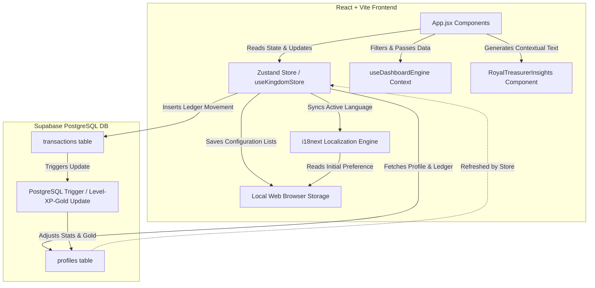

# System Architecture Report: Eldoria (Medieval Stuff)

This document provides a comprehensive technical audit and specification of the system architecture of the **Eldoria** game application. It details the state management layer, dynamic database synchronization, localization engine, and interactive layout structure.

---

## 1. High-Level Architecture & System Flow

Eldoria operates on a modern **BaaS (Backend-as-a-Service)** architecture, pairing a reactive React + Vite frontend with a Supabase PostgreSQL database for persistent data storage, real-time trigger updates, and user session statistics.

### Core Data Flow

1. **User Action**: The user records a transaction (ledger movement) in the Mine Modal or History Modal.
2. **Zustand Action Dispatch**: The application dispatches `registerTransaction` to insert the row into Supabase's `transactions` table.
3. **Database-Level Calculations**: PostgreSQL triggers automatically calculate the profile's accumulated XP, Level, and Gold balance in response to the insertion.
4. **Atomic State Refresh**: To avoid full-table data fetching overhead and race conditions, the store locally appends the inserted transaction to the `transactions` array and performs a lightweight single-row fetch from the `profiles` table to sync the new `gold`, `xp`, and `level` generated by the triggers.

---

## 2. State Management & Data Persistence

Eldoria separates state into two primary scopes: **global runtime states (Zustand)** and **persistent client-side lists (LocalStorage)**.

### A. Zustand Global Store (`useKingdomStore.js`)

Located in `client/src/store/useKingdomStore.js`, the Zustand store handles:

- **Stat State**: Core scalar values `gold`, `gems`, `xp`, `level`, `email`, and loading spinners (`isLoading`).
- **Dashboard Views State**: Pristine adapter layers including `kpiSummary`, `payablesReceivablesKpis`, `liabilitiesKpis`, `flowByCategory` matrix, `timeEvolution` timeline, and `topEntities` arrays.
- **Ledger Records**: The global `transactions` array representing the audit log.
- **Interactive Configuration Playloads**: Option arrays (`fromOptions`, `statusOptions`, `classOptions`, `subClassOptions`, `entityOptions`, `categoryOptions`, `monthOptions`), Quick Actions templates (`templates`), and dynamic category mapping schema (`entityMappings`).
- **Database Operations**: Async dispatches to Supabase:
  - `fetchKingdomData`: Fast single-row profile state polling that minimizes overhead.
  - `fetchDashboardData` (Action Isolation): Heavy multi-row transaction reads isolated to the dashboard and ledger layouts.
  - `registerTransaction`: Installs a single transaction record, updating the local state via local unshifting (`[newTx, ...transactions]`) while reloading profile stats and refreshing dashboard variables.
  - `registerTransactions`: Multi-row batch inserts via a single transactional query to prevent multiple single updates.
  - `borrowLoan`: Double-entry transaction compiler generating matching accrual and cash records for liabilities.
  - `settlePayable`: Toggles the outstanding ledger record to `'Completed'` and registers a corresponding cash outflow transaction.
  - `addOption` / `deleteOption`: Modifies localized options arrays (and custom Quick Action templates) dynamically and persists updates to LocalStorage.
- **Atomic Optimizations**: The `registerTransaction` and `registerTransactions` hooks avoid massive synchronization loops by locally unshifting arrays and performing single-row polls for trigger-calculated values (`gold`, `xp`, `level`).
- **Synchronizations**: Exposes a `setLanguage` dispatch which modifies the store state and synchronizes runtime locales via `i18n.changeLanguage(lang)`.

### B. LocalStorage Configurations

To ensure a personalized, modular experience without querying DB configurations continuously, customizable user inputs are saved directly under the `eldoria_` prefix:

- `eldoria_fromOptions`: List of payers/origins.
- `eldoria_categoryOptions`: High-level category groupings.
- `eldoria_entityOptions`: Specific commercial entities/destinations.
- `eldoria_entityMappings`: Key-value map linking entities accurately to their parent categories.
- `eldoria_templates`: User-customizable Quick Action templates.
- `eldoria_language`: Active locale key.

> [!NOTE]
> Fixed database taxonomy constraints (e.g., `classOptions`, `subClassOptions`, `statusOptions`, `monthOptions`) have been explicitly purged from LocalStorage initialization loops and exist purely as static state configurations to guarantee Engine stability.

### C. Batch Ledger Selection & Editing Workspace

To facilitate mass updates to the treasury books without page navigation or multiple single-query database requests, the Gold Mine ledger supports a multi-row selection and inline editing workspace:

1. **Selection Set Tracking**: Selection states are managed at the page component level using the `selectedTxIds` array. A "Select All" control dynamically checks/unchecks the entire active transaction set. Checkbox styling adheres strictly to the `AGENTS.md` parameters (parchment overlay backdrops, wood borders, and inner gold indicator squares).
2. **Local Sandbox Cache (`editingTxs`)**: When inline editing is initiated, the selected records are cloned from the read-only store into a localized mutable workspace object (`editingTxs`). This sandbox holds current modifications (e.g., changes to Amount, Payer, Class, Subclass, Creditor, or Status) before they are finalized.
3. **Atomic Batch Database Sync**: Upon clicking "Save", the app initiates a single, atomic `upsert` query to the Supabase `transactions` table.
4. **Trigger-Driven Balance Synchronizations**: Following a successful batch update, the client triggers `fetchKingdomData` and `fetchDashboardData` to pull the new trigger-recalculated Gold/XP balances and refresh the analytics engine.
5. **Rollback & State Discard**: Cancel actions clear the selection array and discard the `editingTxs` sandbox object, leaving store state intact.

---

## 3. Localization Architecture (i18next & English-First Structure)

Eldoria integrates **i18next** with a custom localization engine setup. To optimize token overhead during frontend iterations, the codebase operates on an **"English-First" development base** where secondary locales are frozen at the configuration level.

### Key Technical Implementations & English-First Lockdown

1. **Explicit Locale Freeze**: Inside `i18n.js`, secondary imports are commented out and the configuration strictly registers only the English namespace resource. The active runtime language (`lng`) and fallback (`fallbackLng`) are hardlocked to `'en'`.
2. **Semantic Keys & Nested Tokenization**: All display text is systematically mapped to key calls. Hardcoded layout table headers are refactored to use nested translation lookups.
3. **Dynamic Property Proxy Wrapper**: In `App.jsx`, the `t` translator hook runs behind a **JavaScript Proxy**. This intercepts property access and seamlessly maps it to target the active English dictionary keys.
4. **Contextual Advisor Localization Keys**: Added specific locale properties (`advice_financial_position_positive`, `advice_financial_position_negative`, `advice_expenses_report`, `advice_expenses_detailed`, `advice_debt_positive`, `advice_debt_free`) to the English namespace dictionary to enable localized advisor counsel rendering through the dynamic proxy setup.

---

## 4. UI/UX Stacking & Responsive Gestures

The layout is structured using a mobile-first responsive framework that guarantees stability across both touch interfaces and desktop pointers, employing stacking context separation and gesture controls.

### A. Viewport Lock & Touch Bounds

- **Elastic Scroll Prevention**: Dynamic height (`100dvh`), `position: fixed`, and `touch-action: manipulation` block iOS and Android pull-to-refresh elastic scroll anomalies.

### B. Adaptive Top HUD & Overlay Stacking

- **Vertical Grid Stacking**: Wraps gracefully from a wide row design on desktop to a compact vertical stack on mobile.

### C. Dashboard Layout Architecture & Scrolling Stacks

- **Fixed Top KPIs & Scrollable Charts**: In the Overview dashboard sub-tab, the layout splits into a fixed top panel containing the 5-card KPI summary header, and a vertically scrollable container below (`overflow-y-auto custom-scrollbar`) hosting the charts and advisor insight blocks. This ensures that the primary financial indicators remain visible at all times during deep analysis.
- **Centered Chart Alignment**: Headers for all chart visualization widgets are centered, providing a cleaner, more focused look aligned with the medieval ledger aesthetic.
- **Filters Default State**: The filter panel defaults to the last year, and automatically initializes the month list up to the current month and quarter list up to the current quarter to avoid showing empty charts on initial load.
- **Interactive Dimming and Focus**: During ledger editing, unselected items (table rows on desktop and cards on mobile) are styled with `opacity-50` and transition easing. This visually isolates the editing set and keeps the UI clean and concentrated.

---

## 5. Database Schema & Triggers (Supabase PostgreSQL)

Persistence and trigger logic is strictly bound to the 4-tier literal string architecture.

    +------------------------------------+          +------------------------------------+
    |              profiles              |          |            transactions            |
    +------------------------------------+          +------------------------------------+
    | id          UUID (PK)              |<----+    | id                   UUID (PK)     |
    | email       TEXT                   |     |    | profile_id           UUID (FK)     |
    | gold        BIGINT                 |     +---o| amount               NUMERIC       |
    | level       INTEGER                |          | "from"               TEXT          |
    | xp          INTEGER                |          | value_date           DATE          |
    | updated_at  TIMESTAMPTZ            |          | posting_date         DATE          |
    +------------------------------------+          | month                TEXT          |
                                                    | year                 INTEGER       |
                                                    | quarter              TEXT          |
                                                    | payment_status       TEXT          |
                                                    | transaction_type     TEXT (CHECK)  |
                                                    | transaction_subtype  TEXT          |
                                                    | entity               TEXT          |
                                                    | transaction_category TEXT          |
                                                    | transaction_nature   TEXT (CHECK)  |
                                                    | transaction_flow     TEXT (CHECK)  |
                                                    | description          TEXT          |
                                                    | due_date             DATE          |
                                                    | payment_method       TEXT          |
                                                    | created_at           TIMESTAMPTZ   |
                                                    +------------------------------------+

### Table Definitions

#### 1. Table: `profiles`

Represents the lord's metadata and statistics.

- `id` (`UUID`, PK) - Connected to Supabase Auth.
- `gold` (`BIGINT`) - Real-time wallet balance.

#### 2. Table: `transactions`

Contains the detailed financial ledger records natively utilizing a modern `snake_case` schema with strict double-entry checks.

- `transaction_type` (`TEXT` - e.g. `'Income'`, `'Expense'`)
- `transaction_subtype` (`TEXT` - e.g. `'Cash receipt'`, `'Cash payment'`)
- `transaction_category` (`TEXT` - High-level grouping, e.g. `'Payroll'`, `'Housing'`)
- `transaction_nature` (`TEXT` - Matrix axis: `'cash'` or `'accrual'`)
- `transaction_flow` (`TEXT` - Matrix axis: `'inflow'` or `'outflow'`)
- `entity` (`TEXT` - Specific destination/origin)
- `"from"` (`TEXT` - Payer/originator of funds)
- `value_date` (`DATE` - Expected transaction completion date)
- `posting_date` (`DATE` - Ledger posting date, defaults to current date)
- `month`, `year`, `quarter` - Automatically derived calendar attributes from `posting_date` for analytics.
- `due_date` (`DATE` - Date limits for payment requirements)
- `payment_method` (`TEXT` - Asset channel: e.g. `'Vault Cash'`)

### Automated Database Triggers & Constraints

1. **Pre-Process Transaction (`tr_pre_transaction_inserted`)**:
   - A `BEFORE INSERT` trigger that automatically extracts calendar attributes (`year`, `month`, `quarter`) from the inserted `posting_date` (or `CURRENT_DATE`), defaults `value_date` to `posting_date` if empty, and defaults empty `payment_status` to `'Completed'`.

2. **Update Profile Stats (`tr_on_transaction_inserted`)**:
   - An `AFTER INSERT` trigger (`update_profile_on_transaction`) that updates the user's `gold` balance, and increments `xp` and `level` accordingly based on transactions.
   - **Trigger Actions Routing Map**:
     - `'Income'`: Increments target user `gold` balance and awards corresponding XP (2 XP per gold coin).
     - `'Expense'`: Decrements user `gold` balance (clamped at a minimum of `0`).
     - `'Savings'`: Increments user `gold` balance if `transaction_flow` is `'inflow'`, decrements if `'outflow'`. No XP is awarded.
     - `'Debt'`: Increments user `gold` balance if `transaction_subtype` is `'New Debt'` or `transaction_flow` is `'inflow'`. Decrements if `transaction_subtype` is `'Amortization'` or `'Interest'` or `transaction_flow` is `'outflow'`. No XP is awarded.
     - `'Payable'` and `'Receivable'`: Discarded entirely from purse updates (no gold or XP calculations) as they represent outstanding unpaid invoices.

3. **Double-Entry Subtype Constraints (`check_double_entry_integrity`)**:
   - An database-level check constraint strictly routing matrix dimensions:
     - Accrual `'Receivable'` entries must have `transaction_flow = 'inflow'`.
     - Accrual `'Payable'` entries must have `transaction_flow = 'outflow'`.
     - Loan borrows (`'New Debt'` subtype) must have `transaction_flow = 'inflow'`.
     - Loan payments (`'Amortization'` or `'Interest'` subtypes) must have `transaction_flow = 'outflow'` and `transaction_nature = 'cash'`.
     - Bypasses check constraints for generic `'Income'` and `'Expense'` lines.

---

## 6. Centralized 4-Tier Data Engine & Dashboard Architecture

The Treasury Dashboard is engineered around a centralized `useDashboardEngine.js` React Context Hook. Instead of running redundant `filter()` and `reduce()` loops inside every component, the engine parses raw transactions into pristine, pre-calculated matrix volumes exactly once per render.

### A. Summary KPI Headers (Tab-specific KPI Rows)

The dashboard uses a dynamic, tab-specific **KPI Summary Row** at the top of the interface. Rather than showing a fixed row globally, the KPIs are filtered dynamically based on the active sub-tab:

1. **Revenues & Expenses (`income_expense`):**
   - **Total Income:** Accrual-basis inflow (`transaction_nature = 'accrual'` and `transaction_flow = 'inflow'`).
   - **Total Expenses:** Accrual-basis outflow (`transaction_nature = 'accrual'` and `transaction_flow = 'outflow'`).
   - **Net Cash Balance:** Derived from cash-basis movements (receipts vs payments).
2. **Payables & Receivables (`payables_receivables`):**
   - **All Payables, Open Payables, All Receivables, Open Receivables, Overdue Rate**: Tracks outstanding assets, liabilities, and their age segments.
3. **Liabilities (`liabilities`):**
   - **Total Debt, To Be Paid, New Liabilities, Amortizations**: Tracks debt principal, borrowing events, and payments.
4. **Overview (`overview`) & Financial Ratios (`ratios`):**
   - The top KPI summary row is hidden, allocating the space entirely to visualization components.

### B. Consolidated Financial Statement Engine

The dashboard engine runs an O(N) single-pass calculation loop to construct the reports:

1. **Royal Income Statement (Profit & Loss)**: Segments accrued revenues vs accrued expenses to calculate Net Accrued Income.
2. **Treasury Cash Flow Statement**: Classifies cash-nature movements into Operating, Investing, and Financing activities.
3. **Balance Sheet**: Dynamically aggregates historical transactions up to the active date filter's cutoff to verify:
   $$\text{Assets (Cash + Receivables)} = \text{Liabilities (Debt)} + \text{Equity (Net Wealth)}$$

### C. Component-Level Pivoting (Autonomous Charts)

The visualization components possess independent interactive logic to pivot their perspectives:

- **FlowByCategoryChart.jsx:** A local `[ Accrual | Cash ]` toggle seamlessly swaps the bar chart metrics between mapping `Total income`/`Total expenses` and `Total receipts`/`Total payments`.
- **TimeEvolutionChart.jsx:** A unified SVG spline rendering system with an interactive **4-checkbox legend**, enabling overlay comparisons of `Total income` vs `Total receipts` curves over the same temporal progression map.
- **TopEntitiesChart.jsx:** The donut chart automatically recalculates segment boundaries and tabular volumes based on a local toggle, tapping directly into the matrix data payload.

### D. Royal Treasurer's Counsel (Contextual Advisor Insights)

To assist the Lord of the Realm with decision-making, the dashboard couples every visualization chart with a dedicated `RoyalTreasurerInsights` advisor widget.

- **Dynamic Render Architecture**: In the Overview sub-tab, charts are paired side-by-side with an instance of `RoyalTreasurerInsights` on large screens (collapsing to a single-column stack on mobile).
- **Contextual Calculations**:
  - **Financial Position Advice**: Evaluates if the net balance is positive (`advice_financial_position_positive`) or negative (`advice_financial_position_negative`), dynamically injecting the formatted inflow or deficit value.
  - **Expenses Distribution Advice**: Identifies the single highest-spending category using the filtered dataset and injects the category name and amount into `advice_expenses_report`.
  - **Detailed Expenses Advice**: Aggregates filtered expenses by individual entity name to pinpoint the heaviest cash drain, formatting the name and amount into `advice_expenses_detailed`.
  - **Debt Advice**: Reads current liabilities; if debt exists, it displays `advice_debt_positive` with the formatted amount, otherwise it displays `advice_debt_free`.

### E. Compact Currency Formatting Engine (`formatNumberCompact`)

To prevent UI overflows and maintain clean layouts on small viewports, the frontend implements a specialized `formatNumberCompact` formatting function:

- **Value Compaction**: Automatically converts large gold numbers to use standard shorthand suffixes (`K`, `M`, `B`, `T`).
- **Medieval Accounting Notation**: Positive values are formatted as `+Value / g` and negative values are wrapped in parentheses as `(Value) / g` (e.g. `+1.2K / g` or `(450) / g`), matching historical double-entry record-keeping style.

---

## 7. Royal Treasury Menu & Navigation Flow

To unify access to different areas of the treasury, the application uses a pop-up **Royal Treasury Menu** modal which acts as the core navigation bridge:

### A. Modal Structure & Button Order

The menu modal is designed to fit on a single screen without scrolling. The modal uses a `max-w-lg` container, with the content area configured as a centered vertical stack (`flex flex-col gap-3.5 max-w-md mx-auto w-full`):

1. **Register Transaction (Top)**: Opens the transaction entry form (`isNewTxModalOpen = true`) and closes the menu.
2. **Treasury Dashboard (Middle)**: Opens the dashboard view (`activeTab = 'dashboard'`), sets the default sub-tab to Overview (`dashSubTab = 'overview'`), and closes the menu. This single option merges the previous *Economic Overview*, *Commercial Accounts*, and *Liabilities & Debt* buttons.
3. **General Ledger (Bottom)**: Opens the general transaction book page (`activeTab = 'transactions'`) and closes the menu. To prevent duplicate access actions, the ledger toolbar's "Register Movement" action button has been removed from this page.
4. **Financial Statements (After General Ledger)**: Opens the consolidated statement tabs (`activeTab = 'financial_statement'`) separately in an isolated modal tab. The button is styled with a distinct, highlighted `menu_primary` (Primary) badge to signal its status as a core financial report.

### B. Sub-menu Navigation Hierarchy & Return Flow

To maintain a structured user experience and prevent unexpected exits directly back to the main map:

- **Escape Key Interception**: A global keyboard event listener in `App.jsx` intercepts the `Escape` key. If the user is currently viewing the dashboard, general ledger, or financial statements sub-menu, pressing `Escape` resets `activeTab` to `'quests'` and simultaneously sets `isTreasuryMenuOpen` to `true`, instantly returning them to the Royal Treasury Menu.
- **Close Buttons & Backdrop Clicks**: All wrapper exit channels (e.g. clicking the top-right `✕` button or clicking the semi-transparent overlay backdrop of the sub-menus) are hooked to route the user back to the 4-button Treasury Menu modal instead of exiting directly to the quests map.

### C. Quick Actions Templating Engine (Register Transaction Modal Sidebar)

To streamline the process of entering frequent transactions, the **Register Transaction** modal features a left-aligned **Quick Actions** sidebar:

- **Dynamic Zustand Store Integration**: Instead of being hardcoded locally, Quick Action templates are loaded dynamically from the Zustand store (`templates` state array) and persisted to LocalStorage (`eldoria_templates`), allowing full customization.
- **Manage Quick Actions Configuration View**: A dedicated **Manage Quick Actions** panel inside the Configuration Panel allows users to view, delete, and add custom Quick Actions:
  - **Label Changes**: The field labels have been modernized to use `Source account` (replacing "Source Account / Bank") and `Amount` (replacing "Amount (Gold)").
  - **Layout Refinement**: The read-only `Source Acc. Name` and `Target Acc. Name` fields have been removed to optimize grid space, and the primary selector dropdowns (`Source account` and `Target Account`) automatically expand to occupy `col-span-8` in the 12-column grid.
  - **Selector Alignment**: The `Select Quick Action:` label renders directly above its dropdown selector in the header.
  - **Header Action Controls**: The bottom form `EDIT` button has been removed and replaced with a `Save` button (`💾`). All control action buttons (Save `💾`, Delete `🗑️`, Add `➕`) are positioned in the top-right header workspace to the left of the quick action dropdown, displaying only symbols and hiding their text labels.
- **Responsive Layout**: On desktop screens, the Register Transaction modal forms a side-by-side split layout (`flex md:flex-row gap-6`), while on mobile viewports it collapses gracefully above the form as a vertical stacked panel.
- **Transactional Templates**: Pre-configured templates map the four-axis transactional integrity constraints onto safe default inputs:
  - **Salary**: Active income, cash basis receipt.
  - **Pay Blacksmith**: Expense payment for tools/equipment category.
  - **Tavern Feast**: Entertainment expense payment.
  - **Borrow Gold**: Direct debt accrual inflow.
  - **Pay Landlord**: Housing rent expense cash outflow.
  - **Purchase Food**: Market groceries cash outflow.
  - **Pay Interest**: Interest payment cash outflow.
- **Form State Pre-filling**: Selecting any template automatically triggers `applyTemplate`, which updates state fields (Class, Subclass, Amount, Payer, Entity, Category, Description, Nature, Flow) and sets both Value Date and Posting Date to the current date. Localized names use a dynamic `t` translations mapping proxy to fallback gracefully to the default template name when custom templates are added by the user.

---

## 8. Authentication, Role-Based Security & RLS Architecture

To safeguard the treasury accounts, Eldoria integrates Supabase Authentication with a robust role-based access control (RBAC) schema and Row Level Security (RLS).

### A. Authentication & Session Persistence
- **Custom Medieval Login Interface (`Login.jsx`)**: An on-screen credential gate handles user authentication (Sign In & Sign Up) and password recovery.
- **Session Persistence Toggle ("Keep user online")**:
  - If enabled, the session token persists inside `localStorage` via default Supabase behavior, keeping the user authenticated across page refreshes.
  - If disabled, a `beforeunload` event handler automatically wipes all local Supabase auth tokens (`sb-*-auth-token`) from storage, forcing session expiration when the tab is closed or refreshed.
- **Password Recovery Flow**: Users can request a recovery scroll (email reset link) via `supabase.auth.resetPasswordForEmail()`, routing back to the application origin.

### B. Zustand Auth Integration (`initAuth`)
- **Active Listener**: The Zustand store mounts a subscription to `supabase.auth.onAuthStateChange()`.
- **Profile & Role Synchronization**: Upon successful login, the listener retrieves the authenticated user's profile and assigns their role (`admin` or `lord`), loading their personal stats (Gold, XP, Level) and triggering the zero-calculation dashboard data syncer.
- **Fail-Safe Logout**: Clicking the Sign Out button (`🚪`) immediately clears local auth tokens, resets the Zustand state (`user: null`), and dispatches `supabase.auth.signOut({ scope: 'local' })` asynchronously in the background. This guarantees instant UI response and prevents connection hangs.

### C. Row Level Security (RLS) & Access Control Matrix
Row Level Security is enabled on all tables. A user's role governs their capabilities:

| Table | Operation | Lord Role Constraint | Admin Role Constraint |
|---|---|---|---|
| `profiles` | SELECT / UPDATE | `auth.uid() = id` (Own Profile Only) | Can read all profiles |
| `transactions` | ALL (CRUD) | `auth.uid() = profile_id` (Own Records Only) | Can read and write all records |

### D. Client Write Safety & Rollbacks
- **Dynamic Payload Injection**: The store's register actions (`registerTransaction` and `registerTransactions`) dynamically inject `profile_id: get().user.id` into Supabase insert payloads to prevent constraint check failures.
- **Optimistic UI Rollbacks**: Transaction dispatches employ a strict `try/catch` block. The UI optimistically displays new transactions instantly; if Supabase rejects the write (e.g. due to an RLS policy violation or database check constraint), the catch block immediately rolls back the state to the previous immutable cache (`prevTransactions`) and fires a toast error to alert the user.

