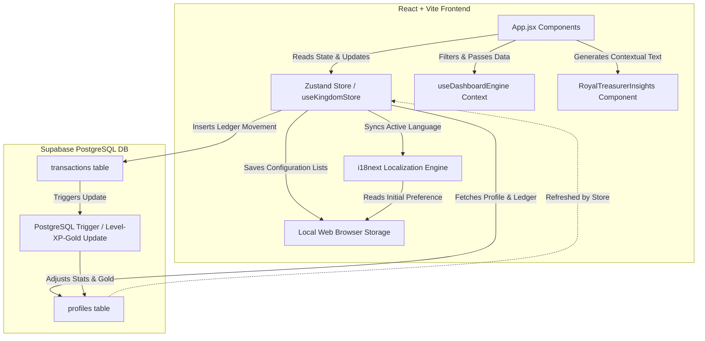

# System Architecture Report: Eldoria (Medieval Stuff)

This document provides a comprehensive technical audit and specification of the system architecture of the **Eldoria** game application. It details the state management layer, dynamic database synchronization, localization engine, and interactive layout structure.

---

## 1. High-Level Architecture & System Flow

Eldoria operates on a modern **BaaS (Backend-as-a-Service)** architecture, pairing a reactive React + Vite frontend with a Supabase PostgreSQL database for persistent data storage, real-time trigger updates, and user session statistics.

### Core Data Flow

1. **User Action**: The user records a transaction (ledger movement) in the Mine Modal or History Modal.
2. **Zustand Action Dispatch**: The application dispatches `registerTransaction` to insert the row into Supabase's `transactions` table.
3. **Database-Level Calculations**: PostgreSQL triggers automatically calculate the profile's accumulated XP, Level, and Gold balance in response to the insertion.
4. **Atomic State Refresh**: To avoid full-table data fetching overhead and race conditions, the store locally appends the inserted transaction to the `transactions` array and performs a lightweight single-row fetch from the `profiles` table to sync the new `gold`, `xp`, and `level` generated by the triggers.

---

## 2. State Management & Data Persistence

Eldoria separates state into two primary scopes: **global runtime states (Zustand)** and **persistent client-side lists (LocalStorage)**.

### A. Zustand Global Store (`useKingdomStore.js`)

Located in `client/src/store/useKingdomStore.js`, the Zustand store handles:

- **Stat State**: `gold`, `gems`, `xp`, `level`, `email`, and loading spinners (`isLoading`).
- **Ledger Records**: `transactions` array.
- **Database Operations**: Async dispatches to Supabase for single or batch transaction entries.
  - **Action Isolation:** Heavy multi-row transaction datasets are strictly isolated to `fetchDashboardTransactions` (only called when visiting the Dashboard or Ledger), keeping `fetchKingdomData` as a lightning-fast single-row profile poller for the core HUD.
- **Atomic Optimizations**: The `registerTransaction` logic avoids massive full-table synchronization payloads by leveraging local array unshifting (`[newTx, ...transactions]`) while only polling Supabase for the calculated profile scalar values (`gold`, `xp`, `level`).
- **Synchronizations**: Triggers dynamic language switches inside the `i18next` engine during store action executions.

### B. LocalStorage Configurations

To ensure a personalized, modular experience without querying DB configurations continuously, customizable user inputs are saved directly under the `eldoria_` prefix:

- `eldoria_fromOptions`: List of payers/origins.
- `eldoria_categoryOptions`: High-level category groupings.
- `eldoria_entityOptions`: Specific commercial entities/destinations.
- `eldoria_entityMappings`: Key-value map linking entities accurately to their parent categories.
- `eldoria_language`: Active locale key.

> [!NOTE]
> Fixed database taxonomy constraints (e.g., `classOptions`, `subClassOptions`, `statusOptions`, `monthOptions`) have been explicitly purged from LocalStorage initialization loops and exist purely as static state configurations to guarantee Engine stability.

### C. Batch Ledger Selection & Editing Workspace

To facilitate mass updates to the treasury books without page navigation or multiple single-query database requests, the Gold Mine ledger supports a multi-row selection and inline editing workspace:

1. **Selection Set Tracking**: Selection states are managed at the page component level using the `selectedTxIds` array. A "Select All" control dynamically checks/unchecks the entire active transaction set. Checkbox styling adheres strictly to the `AGENTS.md` parameters (parchment overlay backdrops, wood borders, and inner gold indicator squares).
2. **Local Sandbox Cache (`editingTxs`)**: When inline editing is initiated, the selected records are cloned from the read-only store into a localized mutable workspace object (`editingTxs`). This sandbox holds current modifications (e.g., changes to Amount, Payer, Class, Subclass, Creditor, or Status) before they are finalized.
3. **Atomic Batch Database Sync**: Upon clicking "Save", the app initiates a single, atomic `upsert` query to the Supabase `transactions` table.
4. **Trigger-Driven Balance Synchronizations**: Following a successful batch update, the client triggers `fetchKingdomData` and `fetchDashboardData` to pull the new trigger-recalculated Gold/XP balances and refresh the analytics engine.
5. **Rollback & State Discard**: Cancel actions clear the selection array and discard the `editingTxs` sandbox object, leaving store state intact.

---

## 3. Localization Architecture (i18next & English-First Structure)

Eldoria integrates **i18next** with a custom localization engine setup. To optimize token overhead during frontend iterations, the codebase operates on an **"English-First" development base** where secondary locales are frozen at the configuration level.

### Key Technical Implementations & English-First Lockdown

1. **Explicit Locale Freeze**: Inside `i18n.js`, secondary imports are commented out and the configuration strictly registers only the English namespace resource. The active runtime language (`lng`) and fallback (`fallbackLng`) are hardlocked to `'en'`.
2. **Semantic Keys & Nested Tokenization**: All display text is systematically mapped to key calls. Hardcoded layout table headers are refactored to use nested translation lookups.
3. **Dynamic Property Proxy Wrapper**: In `App.jsx`, the `t` translator hook runs behind a **JavaScript Proxy**. This intercepts property access and seamlessly maps it to target the active English dictionary keys.
4. **Contextual Advisor Localization Keys**: Added specific locale properties (`advice_financial_position_positive`, `advice_financial_position_negative`, `advice_expenses_report`, `advice_expenses_detailed`, `advice_debt_positive`, `advice_debt_free`) to the English namespace dictionary to enable localized advisor counsel rendering through the dynamic proxy setup.

---

## 4. UI/UX Stacking & Responsive Gestures

The layout is structured using a mobile-first responsive framework that guarantees stability across both touch interfaces and desktop pointers, employing stacking context separation and gesture controls.

### A. Viewport Lock & Touch Bounds

- **Elastic Scroll Prevention**: Dynamic height (`100dvh`), `position: fixed`, and `touch-action: manipulation` block iOS and Android pull-to-refresh elastic scroll anomalies.

### B. Adaptive Top HUD & Overlay Stacking

- **Vertical Grid Stacking**: Wraps gracefully from a wide row design on desktop to a compact vertical stack on mobile.

### C. Dashboard Layout Architecture & Scrolling Stacks

- **Fixed Top KPIs & Scrollable Charts**: In the Overview dashboard sub-tab, the layout splits into a fixed top panel containing the 5-card KPI summary header, and a vertically scrollable container below (`overflow-y-auto custom-scrollbar`) hosting the charts and advisor insight blocks. This ensures that the primary financial indicators remain visible at all times during deep analysis.
- **Centered Chart Alignment**: Headers for all chart visualization widgets are centered, providing a cleaner, more focused look aligned with the medieval ledger aesthetic.
- **Filters Default State**: The filter panel defaults to the last year, and automatically initializes the month list up to the current month and quarter list up to the current quarter to avoid showing empty charts on initial load.
- **Interactive Dimming and Focus**: During ledger editing, unselected items (table rows on desktop and cards on mobile) are styled with `opacity-50` and transition easing. This visually isolates the editing set and keeps the UI clean and concentrated.

---

## 5. Database Schema & Triggers (Supabase PostgreSQL)

Persistence and trigger logic is strictly bound to the 4-tier literal string architecture.

   +------------------------------------+          +------------------------------------+
   |              profiles              |          |            transactions            |
   +------------------------------------+          +------------------------------------+
   | id          UUID (PK)              |<----+    | id                   UUID (PK)     |
   | email       TEXT                   |     |    | profile_id           UUID (FK)     |
   | gold        BIGINT                 |     +---o| amount               NUMERIC       |
   | level       INTEGER                |          | "from"               TEXT          |
   | xp          INTEGER                |          | date                 DATE          |
   | updated_at  TIMESTAMPTZ            |          | month                TEXT          |
   +------------------------------------+          | year                 INTEGER       |
                                                   | quarter              TEXT          |
                                                   | payment_status       TEXT          |
                                                   | transaction_type     TEXT          |
                                                   | transaction_subtype  TEXT          |
                                                   | entity               TEXT          |
                                                   | transaction_category TEXT          |
                                                   | transaction_nature   TEXT (CHECK)  |
                                                   | transaction_flow     TEXT (CHECK)  |
                                                   | description          TEXT          |
                                                   | created_at           TIMESTAMPTZ   |
                                                   +------------------------------------+

### Table Definitions

#### 1. Table: `profiles`

Represents the lord's metadata and statistics.

- `id` (`UUID`, PK) - Connected to Supabase Auth.
- `gold` (`BIGINT`) - Real-time wallet balance.

#### 2. Table: `transactions`

Contains the detailed financial ledger records natively utilizing a modern `snake_case` schema with strict double-entry checks.

- `transaction_type` (`TEXT` - e.g. `'Income'`, `'Expense'`)
- `transaction_subtype` (`TEXT` - e.g. `'Cash receipt'`, `'Cash payment'`)
- `transaction_category` (`TEXT` - High-level grouping, e.g. `'Payroll'`, `'Housing'`)
- `transaction_nature` (`TEXT` - Matrix axis: `'cash'` or `'accrual'`)
- `transaction_flow` (`TEXT` - Matrix axis: `'inflow'` or `'outflow'`)
- `entity` (`TEXT` - Specific destination/origin)
- `"from"` (`TEXT` - Payer/originator of funds)
- `description` (`TEXT` - Optional notes)
- `date`, `month`, `year`, `quarter` - Automatically derived calendar attributes for analytics.

### Automated Database Triggers

1. **Pre-Process Transaction (`tr_pre_transaction_inserted`)**:
   - A `BEFORE INSERT` trigger that automatically extracts calendar attributes (`year`, `month`, `quarter`) from the inserted `date` (or `CURRENT_DATE`), and defaults empty `payment_status` to `'Completed'`.

2. **Update Profile Stats (`tr_on_transaction_inserted`)**:
   - An `AFTER INSERT` trigger that updates the user's `gold` balance, and increments `xp` and `level` accordingly based on income.
   - If `NEW.transaction_type = 'Income'`: Adds the transaction amount to the user's `gold` balance, and calculates `xp`.
   - If `NEW.transaction_type != 'Income'`: Subtracts the transaction amount from the user's `gold` balance.

---

## 6. Centralized 4-Tier Data Engine & Dashboard Architecture

The Treasury Dashboard is engineered around a centralized `useDashboardEngine.js` React Context Hook. Instead of running redundant `filter()` and `reduce()` loops inside every component, the engine parses raw transactions into pristine, pre-calculated 2x2 matrix volumes exactly once per render.

### A. Summary KPI Headers (Tab-specific KPI Rows)

The dashboard uses a dynamic, tab-specific **KPI Summary Row** at the top of the interface. Rather than showing a fixed 5-card row globally, the KPIs are filtered dynamically based on the active sub-tab:

1. **Revenues & Expenses (`income_expense`):**
   - **Total Income:** Accrual-basis inflow (`transaction_nature = 'accrual'` and `transaction_flow = 'inflow'`).
   - **Total Expenses:** Accrual-basis outflow (`transaction_nature = 'accrual'` and `transaction_flow = 'outflow'`).
   - **Net Cash Balance:** Derived from cash-basis movements (receipts vs payments).
2. **Equity & Savings (`equity_savings`):**
   - **Real Savings Rate:** Calculated as `(Net Accrual / Total Inflow) * 100` dynamically, representing the percentage of accrued income saved.
3. **Liabilities (`liabilities`):**
   - **Current Debt:** Active outstanding liabilities balance.
4. **Other Tabs (`overview`, `payables_receivables`, `ratios`):**
   - The top KPI summary row is dynamically hidden when no KPIs are specified for the sub-tab.

### B. Component-Level Pivoting (Autonomous Charts)

The visualization components possess independent interactive logic to pivot their perspectives:

- **FlowByCategoryChart.jsx:** A local `[ Accrual | Cash ]` toggle seamlessly swaps the bar chart metrics between mapping `Total income`/`Total expenses` and `Total receipts`/`Total payments`.
- **TimeEvolutionChart.jsx:** A unified SVG spline rendering system with an interactive **4-checkbox legend**, enabling overlay comparisons of `Total income` vs `Total receipts` curves over the same temporal progression map.
- **TopEntitiesChart.jsx:** The donut chart automatically recalculates segment boundaries and tabular volumes based on a local toggle, tapping directly into the matrix data payload.

### C. Royal Treasurer's Counsel (Contextual Advisor Insights)

To assist the Lord of the Realm with decision-making, the dashboard couples every visualization chart with a dedicated `RoyalTreasurerInsights` advisor widget. 
- **Dynamic Render Architecture**: In the Overview sub-tab, charts are paired side-by-side with an instance of `RoyalTreasurerInsights` on large screens (collapsing to a single-column stack on mobile).
- **Contextual Calculations**:
  - **Financial Position Advice**: Evaluates if the net balance is positive (`advice_financial_position_positive`) or negative (`advice_financial_position_negative`), dynamically injecting the formatted inflow or deficit value.
  - **Expenses Distribution Advice**: Identifies the single highest-spending category using the filtered dataset and injects the category name and amount into `advice_expenses_report`.
  - **Detailed Expenses Advice**: Aggregates filtered expenses by individual entity name to pinpoint the heaviest cash drain, formatting the name and amount into `advice_expenses_detailed`.
  - **Debt Advice**: Reads current liabilities; if debt exists, it displays `advice_debt_positive` with the formatted amount, otherwise it displays `advice_debt_free`.

### D. Compact Currency Formatting Engine (`formatNumberCompact`)

To prevent UI overflows and maintain clean layouts on small viewports, the frontend implements a specialized `formatNumberCompact` formatting function:
- **Value Compaction**: Automatically converts large gold numbers to use standard shorthand suffixes (`K`, `M`, `B`, `T`).
- **Medieval Accounting Notation**: Positive values are formatted as `+Value / g` and negative values are wrapped in parentheses as `(Value) / g` (e.g. `+1.2K / g` or `(450) / g`), matching historical double-entry record-keeping style.
