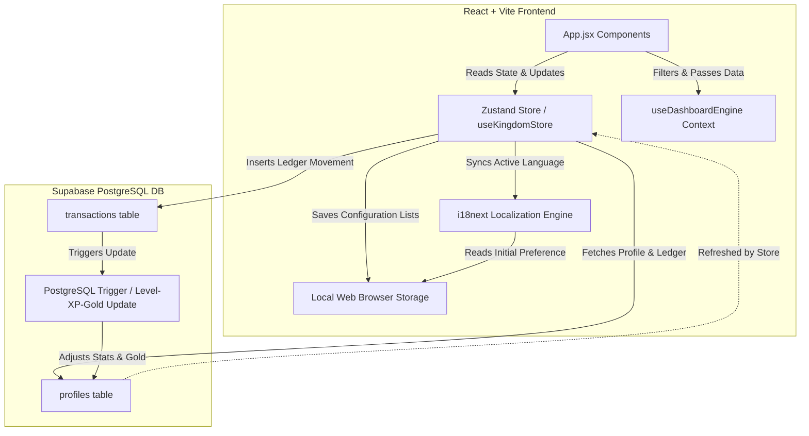

# System Architecture Report: Eldoria (Medieval Stuff)

This document provides a comprehensive technical audit and specification of the system architecture of the **Eldoria** game application. It details the state management layer, dynamic database synchronization, localization engine, and interactive layout structure.

---

## 1. High-Level Architecture & System Flow

Eldoria operates on a modern **BaaS (Backend-as-a-Service)** architecture, pairing a reactive React + Vite frontend with a Supabase PostgreSQL database for persistent data storage, real-time trigger updates, and user session statistics.



### Core Data Flow

1. **User Action**: The user records a transaction (ledger movement) in the Mine Modal or History Modal.
2. **Zustand Action Dispatch**: The application dispatches `registerTransaction` to insert the row into Supabase's `transactions` table.
3. **Database-Level Calculations**: PostgreSQL triggers automatically calculate the profile's accumulated XP, Level, and Gold balance in response to the insertion.
4. **Atomic State Refresh**: To avoid full-table data fetching overhead and race conditions, the store locally appends the inserted transaction to the `transactions` array and performs a lightweight single-row fetch from the `profiles` table to sync the new `gold`, `xp`, and `level` generated by the triggers.

---

## 2. State Management & Data Persistence

Eldoria separates state into two primary scopes: **global runtime states (Zustand)** and **persistent client-side lists (LocalStorage)**.

### A. Zustand Global Store (`useKingdomStore.js`)

Located in `client/src/store/useKingdomStore.js`, the Zustand store handles:

- **Stat State**: `gold`, `gems`, `xp`, `level`, `email`, and loading spinners (`isLoading`).
- **Ledger Records**: `transactions` array.
- **Database Operations**: Async dispatches to Supabase for single or batch transaction entries.
- **Atomic Optimizations**: The `registerTransaction` logic avoids massive full-table synchronization payloads by leveraging local array unshifting (`[newTx, ...transactions]`) while only polling Supabase for the calculated profile scalar values (`gold`, `xp`, `level`).
- **Synchronizations**: Triggers dynamic language switches inside the `i18next` engine during store action executions.

### B. LocalStorage Configurations

To ensure a personalized, modular experience without querying DB configurations continuously, options list settings are saved directly under the `eldoria_` prefix:

- `eldoria_fromOptions`: List of payers/origins.
- `eldoria_statusOptions`: Ledger status constraints.
- `eldoria_classOptions`: Core transaction classes.
- `eldoria_subClassOptions`: Subclasses.
- `eldoria_categoryOptions`: High-level category groupings.
- `eldoria_entityOptions`: Specific commercial entities/destinations.
- `eldoria_entityMappings`: Key-value map linking entities accurately to their parent categories.
- `eldoria_language`: Active locale key.

---

## 3. Localization Architecture (i18next & English-First Structure)

Eldoria integrates **i18next** with a custom localization engine setup. To optimize token overhead during frontend iterations, the codebase operates on an **"English-First" development base** where secondary locales are frozen at the configuration level.

### Key Technical Implementations & English-First Lockdown

1. **Explicit Locale Freeze**: Inside `i18n.js`, secondary imports are commented out and the configuration strictly registers only the English namespace resource. The active runtime language (`lng`) and fallback (`fallbackLng`) are hardlocked to `'en'`.
2. **Semantic Keys & Nested Tokenization**: All display text is systematically mapped to key calls. Hardcoded layout table headers are refactored to use nested translation lookups.
3. **Dynamic Property Proxy Wrapper**: In `App.jsx`, the `t` translator hook runs behind a **JavaScript Proxy**. This intercepts property access and seamlessly maps it to target the active English dictionary keys.

---

## 4. UI/UX Stacking & Responsive Gestures

The layout is structured using a mobile-first responsive framework that guarantees stability across both touch interfaces and desktop pointers, employing stacking context separation and gesture controls.

### A. Viewport Lock & Touch Bounds
- **Elastic Scroll Prevention**: Dynamic height (`100dvh`), `position: fixed`, and `touch-action: manipulation` block iOS and Android pull-to-refresh elastic scroll anomalies.

### B. Adaptive Top HUD & Overlay Stacking
- **Vertical Grid Stacking**: Wraps gracefully from a wide row design on desktop to a compact vertical stack on mobile.

---

## 5. Database Schema & Triggers (Supabase PostgreSQL)

Persistence and trigger logic is strictly bound to the 4-tier literal string architecture.

```
   +------------------------------------+          +------------------------------------+
   |              profiles              |          |            transactions            |
   +------------------------------------+          +------------------------------------+
   | id          UUID (PK)              |<----+    | id                   UUID (PK)     |
   | email       TEXT                   |     |    | profile_id           UUID (FK)     |
   | gold        BIGINT                 |     +---o| "Transaction Class"  TEXT          |
   | level       INTEGER                |          | amount               NUMERIC       |
   | xp          INTEGER                |          | "Transaction Subclass" TEXT        |
   | updated_at  TIMESTAMPTZ            |          | entity               TEXT          |
   +------------------------------------+          | "Transaction Category" TEXT        |
                                                   | status               TEXT          |
                                                   | created_at           TIMESTAMPTZ   |
                                                   +------------------------------------+
```

### Table Definitions

#### 1. Table: `profiles`
Represents the lord's metadata and statistics.
- `id` (`UUID`, PK) - Connected to Supabase Auth.
- `gold` (`BIGINT`) - Real-time wallet balance.

#### 2. Table: `transactions`
Contains the detailed financial ledger records natively utilizing literal space-separated column names.
- `"Transaction Class"` (`TEXT` - e.g. `'Income'`, `'Expense'`)
- `"Transaction Subclass"` (`TEXT` - e.g. `'Cash receipt'`, `'Cash payment'`)
- `"Transaction Category"` (`TEXT` - High-level grouping, e.g. `'Payroll'`, `'Housing'`)
- `entity` (`TEXT` - Specific destination/origin)

### Automated Database Triggers

When a new row is written into `transactions`:
- If `NEW."Transaction Class" = 'Income'`: Adds the transaction amount to the user's `gold` balance, and increments `xp`.
- If `NEW."Transaction Class" != 'Income'`: Subtracts the transaction amount from the user's `gold` balance.

---

## 6. Centralized 4-Tier Data Engine & Dashboard Architecture

The Treasury Dashboard is engineered around a centralized `useDashboardEngine.js` React Context Hook. Instead of running redundant `filter()` and `reduce()` loops inside every component, the engine parses raw transactions into pristine, pre-calculated 4-tier volumes exactly once per render.

### A. Dual-Row KPI Summary
The top-level dashboard displays two distinct statistical rows simultaneously without relying on global abstract modes:
1. **Class Summary Row:** Total Class Income | Total Class Expense | Net Class Balance | Efficiency
2. **Subclass Summary Row:** Total Subclass Receipts | Total Subclass Payments | Net Subclass Balance | Efficiency

### B. Component-Level Pivoting (Autonomous Charts)
The visualization components possess independent interactive logic to pivot their perspectives:

*   **FlowByCategoryChart.jsx:** A local `[ Class | Subclass ]` toggle seamlessly swaps the bar chart metrics between mapping `Transaction Class` attributes (Income/Expense) and `Transaction Subclass` attributes (Receipts/Payments).
*   **TimeEvolutionChart.jsx:** A unified SVG spline rendering system with an interactive **4-checkbox legend**, enabling overlay comparisons of `Class Income` vs `Sub Receipt` curves over the same temporal progression map.
*   **TopEntitiesChart.jsx:** The donut chart automatically recalculates segment boundaries and tabular volumes based on a local `[ Class | Subclass ]` toggle, tapping directly into the `engineData.entityData` payload.
