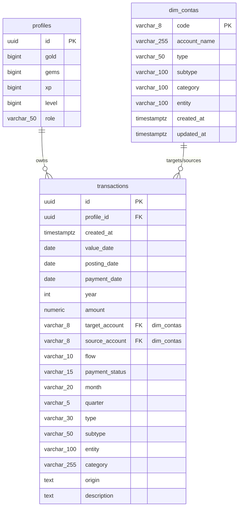

# 🗄️ Eldoria V2.4 Database Schema Information

This document outlines the schema details, constraint validations, indexes, and triggers for the core database tables in Eldoria.

---

## 1. Table: `public.dim_contas` (Chart of Accounts Matrix)

The dimensions table representing the flattened Chart of Accounts (COA). Acts as the single source of truth for account filtering and validation.

### Column Definitions
| Column Name | Data Type | Nullable | Default | Description / Constraints |
| :--- | :--- | :--- | :--- | :--- |
| **`code`** (PK) | `character varying(8)` | No | *None* | Primary Key. Must be exactly 8 digits (`chk_code_length` check constraint). |
| `account_name` | `character varying(255)` | No | *None* | Human-readable account identifier. |
| `type` | `character varying(50)` | No | *None* | Core accounting type (e.g., `Assets`, `Liabilities`, `Income`, `Expense`). |
| `subtype` | `character varying(100)` | No | *None* | Category classification (e.g., `Liquid Assets`, `Checking Accounts`). |
| `category` | `character varying(100)` | No | *None* | Sub-classification details. |
| `entity` | `character varying(100)` | No | *None* | Controlling entity or bank (e.g., `CGD`, `Cash`). |
| `created_at` | `timestamp with time zone` | No | `timezone('utc'::text, now())` | Record insertion timestamp. |
| `updated_at` | `timestamp with time zone` | No | `timezone('utc'::text, now())` | Record modification timestamp. |

### Constraints
* **`dim_contas_pkey`**: Primary key constraint on `code`.
* **`chk_code_length`**: CHECK constraint verifying that `code` matches the regular expression `^[0-9]{8}$`.

---

## 2. Table: `public.transactions` (Ledger Entries)

The transactional ledger table containing all double-entry coin movements and account updates.

### Column Definitions
| Column Name | Data Type | Nullable | Default | Description / Constraints |
| :--- | :--- | :--- | :--- | :--- |
| **`id`** (PK) | `uuid` | No | `gen_random_uuid()` | Primary Key. Unique entry ID. |
| `profile_id` (FK) | `uuid` | Yes | *None* | Foreign Key references `profiles(id)` on delete CASCADE. |
| `created_at` | `timestamp with time zone` | Yes | `now()` | Row creation timestamp. |
| `value_date` | `date` | No | `CURRENT_DATE` | Date when financial value is realized. |
| `posting_date` | `date` | No | `CURRENT_DATE` | Date when the transaction was logged. |
| `payment_date` | `date` | Yes | *None* | Settlement date (for payables/receivables). |
| `year` | `integer` | Yes | *None* | Extracted year of transaction. |
| `amount` | `numeric` | No | *None* | Quantitative gold value. Must be `>= 0` (`transactions_amount_check`). |
| `target_account` | `character varying(8)` | No | *None* | The target account code. Connects to `dim_contas(code)`. |
| `source_account` | `character varying(8)` | Yes | *None* | The source account code (transfers/payments). Connects to `dim_contas(code)`. |
| `flow` | `character varying(10)` | No | *None* | Funds direction: `'inflow'`, `'outflow'`, or `'neutral'` (`transactions_flow_check`). |
| `payment_status` | `character varying(15)` | No | `'Completed'` | Settlement status: `'Pending'` or `'Completed'` (`transactions_payment_status_check`). |
| `month` | `character varying(20)` | Yes | *None* | Derived month name. |
| `quarter` | `character varying(5)` | Yes | *None* | Derived quarter indicator (e.g. `Q1`). |
| `type` | `character varying(30)` | No | *None* | Transaction type (`transactions_type_check`). |
| `subtype` | `character varying(50)` | Yes | *None* | Optional transaction sub-classification. |
| `entity` | `character varying(100)` | Yes | *None* | Target entity name. |
| `category` | `character varying(255)` | Yes | *None* | Target category classification. |
| `origin` | `text` | Yes | *None* | Channel source of import. |
| `description` | `text` | Yes | *None* | Explanatory note for the transaction. |

* **`transactions_pkey`**: Primary key constraint on `id`.
* **`transactions_profile_id_fkey`**: Foreign key pointing to `profiles(id)` with cascading delete.
* **`transactions_amount_check`**: CHECK constraint verifying that `amount >= 0`.
* **`transactions_flow_check`**: CHECK constraint restricting values to `'inflow'`, `'outflow'`, or `'neutral'`.
* **`transactions_payment_status_check`**: CHECK constraint restricting values to `'Pending'` or `'Completed'`.
* **`transactions_type_check`**: CHECK constraint restricting transaction types to: `'Assets'`, `'Liabilities'`, `'Income'`, `'Expense'`, `'Expenses'`, `'Receivable'`, or `'Payable'`.
* **`check_double_entry_integrity`**: CHECK constraint enforcing logical consistency between transaction `type` and currency `flow`:
  * If `type` = `'Receivable'`, `flow` must be `'inflow'`.
  * If `type` = `'Payable'`, `flow` must be `'outflow'`.
  * Allows `'Income'`, `'Expense'`, `'Expenses'`, and `'Liabilities'` types dynamically.

---

## 3. Table: `public.profiles` (User Kingdom Profile)

Stores gamification progress and player statistics synced dynamically with treasury events.

### Column Definitions
| Column Name | Data Type | Nullable | Default | Description / Constraints |
| :--- | :--- | :--- | :--- | :--- |
| **`id`** (PK) | `uuid` | No | *None* | Primary Key. Maps to Supabase auth user reference. |
| `gold` | `bigint` | Yes | `0` | Dynamic coin balance from transaction completions. |
| `gems` | `bigint` | Yes | `100` | Vault premium currency level. |
| `xp` | `bigint` | Yes | `0` | Experience points compiled from active accounting operations. |
| `level` | `bigint` | Yes | `1` | Computed level calculated from accumulated XP points. |
| `role` | `character varying(50)` | Yes | `'lord'` | Assigned authorization profile (e.g. `'lord'`, `'steward'`). |

---

## 4. Indexes
All indexes are deployed in the `pg_default` tablespace to speed up analytical lookups:

1. **`idx_transactions_profile_id`**: B-Tree index on `profile_id`. Speeds up query loads for specific user sessions.
2. **`idx_transactions_posting_date_desc`**: B-Tree index on `posting_date DESC`. Accelerates ledger page chronology listings.
3. **`idx_transactions_type_status`**: B-Tree index on `(type, payment_status)`. Speeds up calculations for open accounts (Payables/Receivables).

---

## 5. Triggers & Stored Functions

### `tr_pre_transaction_inserted`
* **Execution Phase**: `BEFORE INSERT OR UPDATE ON public.transactions FOR EACH ROW`
* **Trigger Function**: `pre_process_transaction()`
* **Role**: Runs sanitization logic, pre-populates derived calendar periods (month, quarter, year), and ensures double-entry format rules.

### `trigger_sync_profile_gold`
* **Execution Phase**: `AFTER INSERT OR UPDATE OR DELETE ON public.transactions FOR EACH ROW`
* **Trigger Function**: `sync_profile_gold_on_transaction()`
* **Role**: Automatically updates user gamification statistics (gold balances and XP levels) in `public.profiles` whenever a transaction is completed or deleted.

---

## 6. Row Level Security (RLS)

To secure user ledger items, Row Level Security is enabled on the `public.transactions` table. Users must be authenticated and are restricted to operations where their authenticated user ID matches the transaction's `profile_id`.

* **Table**: `public.transactions`
* **Policies**:
  * **`Users can view their own transactions`** (SELECT): Enforces `auth.uid() = profile_id`.
  * **`Users can insert their own transactions`** (INSERT): Enforces `auth.uid() = profile_id`.
  * **`Users can update their own transactions`** (UPDATE): Enforces `auth.uid() = profile_id`.
  * **`Users can delete their own transactions`** (DELETE): Enforces `auth.uid() = profile_id`.

