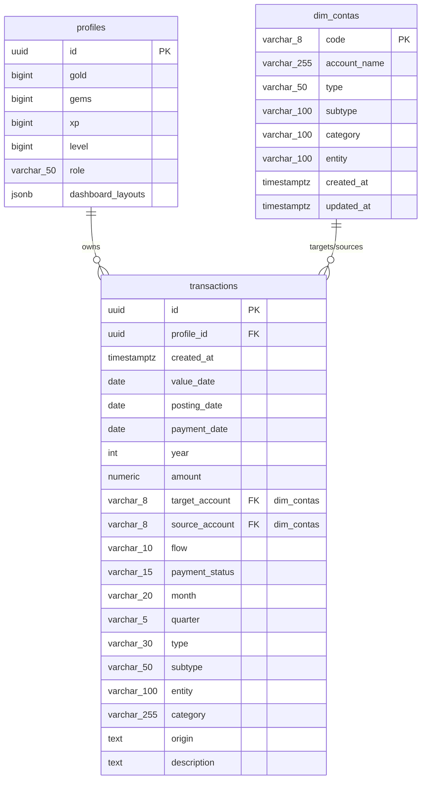

# 🗄️ Eldoria V3.0 Database Schema Information

This document outlines the schema details, constraint validations, indexes, triggers, optimized views, and server-side RPC functions for the database in Eldoria.

```mermaid
erDiagram
    profiles {
        uuid id PK
        bigint gold
        bigint gems
        bigint xp
        bigint level
        varchar_50 role
        jsonb dashboard_layouts
    }
    dim_contas {
        varchar_8 code PK
        varchar_255 account_name
        varchar_50 type
        varchar_100 subtype
        varchar_100 category
        varchar_100 entity
        timestamptz created_at
        timestamptz updated_at
    }
    transactions {
        uuid id PK
        uuid profile_id FK
        timestamptz created_at
        date value_date
        date posting_date
        date payment_date
        int year
        numeric amount
        varchar_8 target_account FK "dim_contas"
        varchar_8 source_account FK "dim_contas"
        varchar_10 flow
        varchar_15 payment_status
        varchar_20 month
        varchar_5 quarter
        varchar_30 type
        varchar_50 subtype
        varchar_100 entity
        varchar_255 category
        text origin
        text description
    }

    profiles ||--o{ transactions : "owns"
    dim_contas ||--o{ transactions : "targets/sources"
```

---

## 1. Table: `public.dim_contas` (Chart of Accounts Matrix)

The dimensions table representing the flattened Chart of Accounts (COA). Acts as the single source of truth for account filtering and validation.

### Column Definitions
| Column Name | Data Type | Nullable | Default | Description / Constraints |
| :--- | :--- | :--- | :--- | :--- |
| **`code`** (PK) | `character varying(8)` | No | *None* | Primary Key. Must be exactly 8 digits (`chk_code_length` check constraint). |
| `account_name` | `character varying(255)` | No | *None* | Human-readable account identifier. |
| `type` | `character varying(50)` | No | *None* | Core accounting type (e.g., `Assets`, `Liabilities`, `Income`, `Expense`, `Expenses`). |
| `subtype` | `character varying(100)` | No | *None* | Category classification (e.g., `Liquid Assets`, `Checking Accounts`). |
| `category` | `character varying(100)` | No | *None* | Sub-classification details. |
| `entity` | `character varying(100)` | No | *None* | Controlling entity or bank (e.g., `CGD`, `Cash`). |
| `created_at` | `timestamp with time zone` | No | `timezone('utc'::text, now())` | Record insertion timestamp. |
| `updated_at` | `timestamp with time zone` | No | `timezone('utc'::text, now())` | Record modification timestamp. |

---

## 2. Table: `public.transactions` (Ledger Entries)

The transactional ledger table containing all double-entry coin movements and account updates.

### Column Definitions
| Column Name | Data Type | Nullable | Default | Description / Constraints |
| :--- | :--- | :--- | :--- | :--- |
| **`id`** (PK) | `uuid` | No | `gen_random_uuid()` | Primary Key. Unique entry ID. |
| `profile_id` (FK) | `uuid` | Yes | *None* | Foreign Key references `profiles(id)` on delete CASCADE. |
| `created_at` | `timestamp with time zone` | Yes | `now()` | Row creation timestamp. |
| `value_date` | `date` | No | `CURRENT_DATE` | Date when financial value is realized. |
| `posting_date` | `date` | No | `CURRENT_DATE` | Date when the transaction was logged. |
| `payment_date` | `date` | Yes | *None* | Settlement date (for payables/receivables). |
| `year` | `integer` | Yes | *None* | Extracted year of transaction. |
| `amount` | `numeric` | No | *None* | Quantitative gold value. Must be `>= 0` (`transactions_amount_check`). |
| `target_account` | `character varying(8)` | No | *None* | The target account code. Connects to `dim_contas(code)`. |
| `source_account` | `character varying(8)` | Yes | *None* | The source account code (transfers/payments). Connects to `dim_contas(code)`. |
| `flow` | `character varying(10)` | No | *None* | Funds direction: `'inflow'`, `'outflow'`, or `'neutral'` (`transactions_flow_check`). |
| `payment_status` | `character varying(15)` | No | `'Completed'` | Settlement status: `'Pending'` or `'Completed'` (`transactions_payment_status_check`). |
| `month` | `character varying(20)` | Yes | *None* | Derived month name. |
| `quarter` | `character varying(5)` | Yes | *None* | Derived quarter indicator (e.g. `Q1`). |
| `type` | `character varying(30)` | No | *None* | Transaction type (`transactions_type_check`). |
| `subtype` | `character varying(50)` | Yes | *None* | Optional transaction sub-classification. |
| `entity` | `character varying(100)` | Yes | *None* | Target entity name. |
| `category` | `character varying(255)` | Yes | *None* | Target category classification. |
| `origin` | `text` | Yes | *None* | Channel source of import. |
| `description` | `text` | Yes | *None* | Explanatory note for the transaction. |

---

## 3. Table: `public.profiles` (User Kingdom Profile)

Stores gamification progress and player statistics synced dynamically with treasury events, as well as layout preferences.

### Column Definitions
| Column Name | Data Type | Nullable | Default | Description / Constraints |
| :--- | :--- | :--- | :--- | :--- |
| **`id`** (PK) | `uuid` | No | *None* | Primary Key. References the authenticated user auth.uid(). |
| `gold` | `bigint` | No | `0` | Player's accumulated gold coins. |
| `gems` | `bigint` | No | `100` | Player's accumulated gems. |
| `xp` | `bigint` | No | `0` | Player's accumulated experience points. |
| `level` | `bigint` | No | `1` | Player's calculated level. |
| `role` | `character varying(50)` | No | `'lord'` | Role in the kingdom (e.g. `'lord'`). |
| `dashboard_layouts` | `jsonb` | Yes | *None* | JSON object storing layout and submenu preferences for the dashboard. |

---

## 4. Database Views (Optimized Analytics Layer)

To optimize frontend performance, heavy double-entry calculations are moved server-side into views:

### `vw_monthly_analytics`
*   **Purpose**: Groups and sums cash inflows and outflows per month.
*   **Columns**: `profile_id` (UUID), `month_date` (Date), `type` (Normalized Type), `total_amount` (Numeric).

### `vw_cumulative_trends`
*   **Purpose**: Tracks running totals of assets, liabilities, and cumulative flow balances.
*   **Columns**: `profile_id` (UUID), `month_date` (Date), `type` (Assets/Liabilities/Income/Expenses), `cumulative_amount` (Numeric).

### `vw_category_balances`
*   **Purpose**: Groups transactional volumes of specific classes by category or subtype.
*   **Columns**: `profile_id` (UUID), `type` (Assets/Liabilities/Income/Expenses), `category` (Text), `total_volume` (Numeric).

### `vw_entity_exposure`
*   **Purpose**: Lists asset and expense concentration balances grouped by counterparty.
*   **Columns**: `profile_id` (UUID), `type` (Assets/Expenses), `entity` (Text), `total_volume` (Numeric), `transaction_count` (BigInt).

### `vw_daily_analytics`
*   **Purpose**: Groups transactional events per single day.
*   **Columns**: `profile_id` (UUID), `day_date` (Date), `type` (Text), `total_amount` (Numeric).

### `vw_account_balances`
*   **Purpose**: Dynamically computes balances for each account and registers them under RLS policies.
*   **Columns**: `profile_id` (UUID), `account_code` (Text), `account_name` (Text), `balance` (Numeric).

---

## 5. Stored Procedures & RPC Functions

### `increment_gamification_stats(user_id, gold_add, xp_add)`
*   **Purpose**: Secure server-side addition of gold coins and experience points. Handles level calculations automatically:
    *   Calculates new level bounds based on newly computed XP sums.
    *   Increments profile metrics and logs milestones.

---

## 6. Edge Functions (Gamification Integration)

*   **`process-gamification`** (Deno Serverless Function):
    *   Triggered in the background via database webhooks when a new transaction is logged.
    *   Verifies payload, processes rewards (Gold/XP based on absolute amounts), and triggers `increment_gamification_stats` RPC securely bypassing RLS via the service role client.

