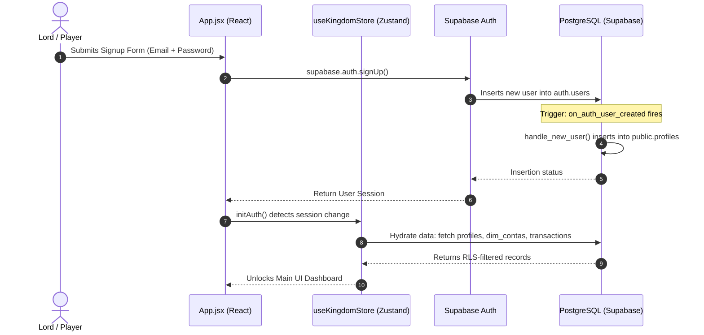

# 🔐 Authentication & Sign-Up Flow in Eldoria

This document describes how user authentication, profile creation, and session hydration are orchestrated across the Eldoria application.

---

## 🏗️ Core Architecture Overview

Authentication in Eldoria relies on a secure handshake between **Supabase Auth**, **Zustand stores**, and **PostgreSQL Database triggers**.



---

## 1. Frontend Security Barrier

The application root [App.jsx](file:///c:/Users/silva/.gemini/antigravity/Medieval%20Stuff/client/src/App.jsx) acts as the primary gatekeeper.

* **Session Validation**: Upon mounting, `App.jsx` triggers `initAuth()` in the [useKingdomStore.js](file:///c:/Users/silva/.gemini/antigravity/Medieval%20Stuff/client/src/store/useKingdomStore.js).
* **UI Lock**: If no active user session is detected, `App.jsx` intercepts the routing and forces the rendering of the `<Login />` panel. No dashboard components are loaded into the DOM.
* **Redirection**: Once the user is authenticated, the app state transitions and unblocks the `<MainMenu />`.

---

## 2. Supabase Signup & Profile Creation (Database Trigger)

When a user signs up:

1. **Auth Registration**: Supabase inserts the credentials into the internal `auth.users` table.
2. **Database Trigger**: An automatic database trigger executes a function (typically `public.handle_new_user()`) on the database side:
   ```sql
   CREATE TRIGGER on_auth_user_created
   AFTER INSERT ON auth.users
   FOR EACH ROW
   EXECUTE FUNCTION public.handle_new_user();
   ```
3. **Profile Insertion**: The function copies the `id` of the new user into the `public.profiles` table to initialize their gamification metrics:
   ```sql
   INSERT INTO public.profiles (id, gold, gems, xp, level, role)
   VALUES (new.id, 0, 100, 0, 1, 'lord');
   ```

> [!WARNING]
> **Common Failure Point**: If the trigger function fails (for example, if columns like `gold` are set as `NOT NULL` but are omitted in the insertion statement, or if RLS policies block the trigger from inserting), the signup fails upstream returning:
> `AuthApiError: Database error saving new user` (500 unexpected failure).

---

## 3. Zustand Store & Hydration

Upon a successful auth event (detected via `supabase.auth.onAuthStateChange`), the Zustand stores trigger sequential data hydration:

* **Kingdom Profile**: `fetchKingdomData(userId)` retrieves the user's gamification stats (gold, gems, level) from the `profiles` table.
* **Chart of Accounts**: `fetchFlatMatrix()` loads the accounts list from `dim_contas`.
* **Ledger Entries**: `fetchTransactions()` queries user-owned rows in the `transactions` table.
* **Aggregated Analytics**: `fetchAnalytics()` retrieves pre-calculated charts from views (`vw_monthly_analytics`, `vw_cumulative_trends`, etc.).
* **Dashboard Layouts**: `hydrateLayouts()` fetches grid configurations from the user's profile (`profiles.dashboard_layouts`).

---

## 4. Row-Level Security (RLS) Enforcement

Once authenticated, all database requests utilize the user's JWT to filter data:

* **Transactional Privacy**: The RLS policy on `public.transactions` restricts views:
  ```sql
  CREATE POLICY "Users can view their own transactions" 
  ON public.transactions FOR SELECT TO authenticated
  USING (auth.uid() = profile_id);
  ```
* **Profile Protection**: Users can only modify their own profile data (such as saving a dashboard layout):
  ```sql
  CREATE POLICY "Users can update their own profile" 
  ON public.profiles FOR UPDATE TO authenticated
  USING (auth.uid() = id);
  ```
